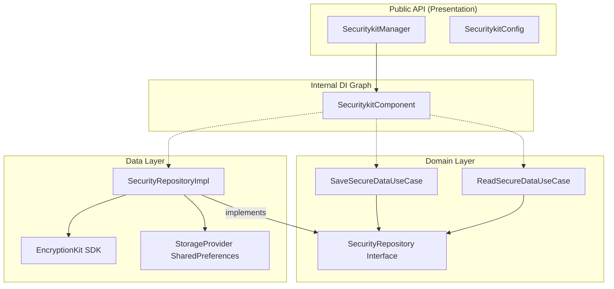

# SecurityKit Android SDK 🛡️

[](https://opensource.org/licenses/Apache-2.0)
[](http://kotlinlang.org)
[](https://developer.android.com/about)

**SecurityKit** is an enterprise-grade security module for Android, designed to provide a "Zero-Trust" persistence layer. It ensures that sensitive data is encrypted using hardware-backed security (via **EncryptionKit**) before it ever touches the disk.

Built with **Clean Architecture**, **Zero-Dependency DI**, and following strict architectural governance.

---

## 🚀 Features

- **Zero-Trust Persistence**: All data is encrypted *before* reaching the storage layer (SharedPreferences via FoundationKit).
- **Hardware-Backed Security**: Uses AES-GCM (256-bit) via Android Keystore (StrongBox supported).
- **Clean Architecture**: Strict separation between Public API, Domain logic, and Data implementation.
- **Zero-Dependency DI**: Internal dependency graph managed without external frameworks (Dagger/Hilt/Koin) for a lightweight SDK footprint.
- **Strategical Logging**: Integrated with `Loggerkit` for effective flow tracing.
- **Flexible Configuration**: DSL-based configuration for easy setup.

---

## 📦 Installation

Add the dependency to your `build.gradle.kts`:

```kotlin
dependencies {
    implementation("es.joshluq.kit:securitykit:1.0.0-SNAPSHOT")
}
```

---

## 🛠️ Quick Start

### 1. Initialize the SDK

Initialize `SecuritykitManager` in your `Application` class:

```kotlin
val config = SecuritykitConfig.build(context) {
    storeName = "my_secure_prefs"
    // Optional: provide custom providers
    // encryptionProvider = CustomEncryptionProvider()
    // logger = CustomLogger()
    // serializerProvider = CustomSerializer()
}

SecuritykitManager.getInstance().initialize(config)
```

### 2. Save Secure Data

```kotlin
val securityKit = SecuritykitManager.getInstance()

lifecycleScope.launch {
    securityKit.save("user_token", "super-secret-value")
}
```

### 3. Read Secure Data

```kotlin
lifecycleScope.launch {
    securityKit.read("user_token")
        .onSuccess { value ->
            println("Decrypted value: $value")
        }
        .onFailure { error ->
            println("Error retrieving data: ${error.message}")
        }
}
```

---

## 🏗️ Architecture & Governance

This SDK follows the governance rules defined in `AGENTS.md` and implements a strict **Clean Architecture** pattern:



- **Public API**: Only `SecuritykitManager` and `SecuritykitConfig` are exposed.
- **Domain Layer**: Contains the business logic and Use Cases (Single Use Case Pattern).
- **Data Layer**: Implements the repository pattern using `StorageProvider` (SharedPreferences) and `EncryptionKit`.
- **DI**: Managed via `SecuritykitComponent`, ensuring the SDK remains a pure library without requiring parent apps to use specific DI frameworks.

---

## 🔍 Logging

The SDK uses `Loggerkit` for internal tracing. You can see the flow in Logcat:

- `🔍 SecuritykitManager`: General SDK state and API calls.
- `🔍 SaveSecureDataUseCase`: Domain execution flow.
- `🔍 SecurityRepositoryImpl`: Data persistence and encryption status.

---

## 🧪 Testing

The SDK includes a testing backdoor for internal component injection, facilitating unit testing with MockK:

```kotlin
val mockComponent = mockk<SecuritykitComponent>()
val manager = SecuritykitManager(componentFactory = { mockComponent })
// Test your logic...
```

---

## 📄 License

```text
Copyright 2024 JoshLuq.

Licensed under the Apache License, Version 2.0 (the "License");
you may not use this file except in compliance with the License.
You may obtain a copy of the License at

    http://www.apache.org/licenses/LICENSE-2.0

Unless required by applicable law or agreed to in writing, software
distributed under the License is distributed on an "AS IS" BASIS,
WITHOUT WARRANTIES OR CONDITIONS OF ANY KIND, either express or implied.
See the License for the specific language governing permissions and
limitations under the License.
```
